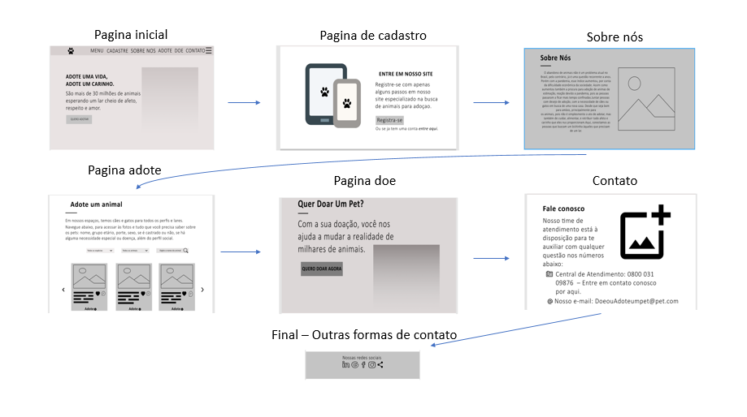

# Projeto de Interface

Desenvolvemos uma montagem da interface do sistema, com capacidade para se adaptar ao ambiente de acesso do usuário, conforme os dispositivos utilizados.
Desta forma, todo conteúdo e padrão de layout podem ser transportados para as mais variadas orientações, plataformas e dimensões de tela, com foco na facilidade de navegação, disponibilidade e usabilidade.

## Fluxo do Usuário

O diagrama da Figura a seguir mostra o fluxo de interação do usuário através das telas do sistema. Cada uma das telas neste fluxo é descrita em detalhes na seção de Wireframes. Para visualizar o Wireframe interativo, acesse o Figma.(https://www.figma.com/file/LrRbbZ3COSTbXcRlPDNx41/Projeto-Wiframes?nodeid=0%3A1)

                               Acima e mostrado o fluxo de telas do usuário.

## Wireframes

A seguir nas telas do projeto, as telas do sistema são apresentadas em detalhes nos itens que se seguem. Apresentando uma estrutura comum que é composta por um cabeçalho, conteúdo e rodapé, apresentada na Figura a seguir:

⦁ Cabeçalho (header) - onde se encontra os elementos fixos de identidade (logo) e navegação principal do site (menu da aplicação). 
⦁ Conteúdo (body) - apresenta o conteúdo da tela em questão. 
⦁ Rodapé (footer) - apresenta a última parte a ser vista por um visitante, que chegou ao final da página.

                                        Estrutura padrão do site.
