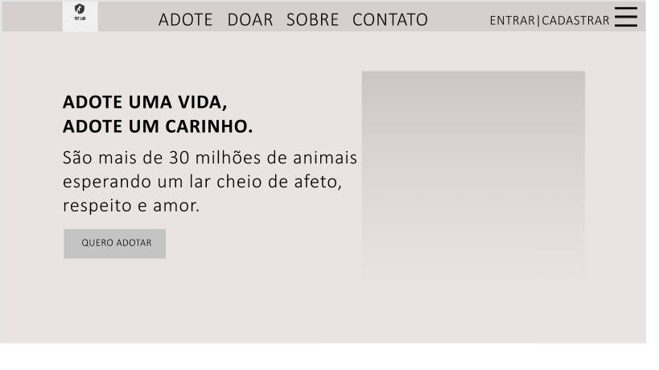
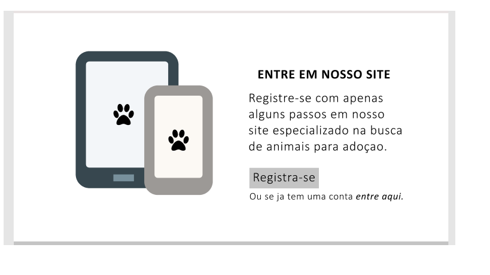
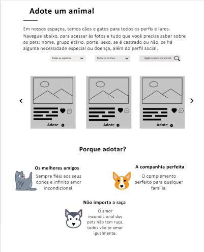
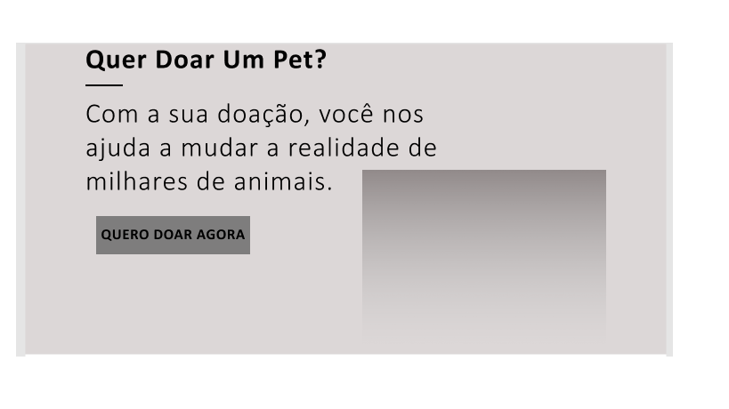
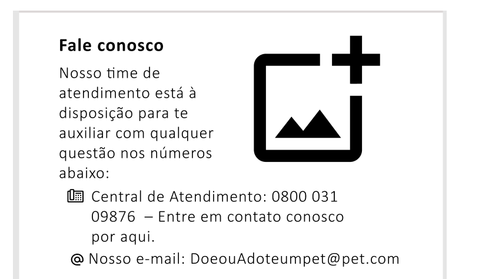
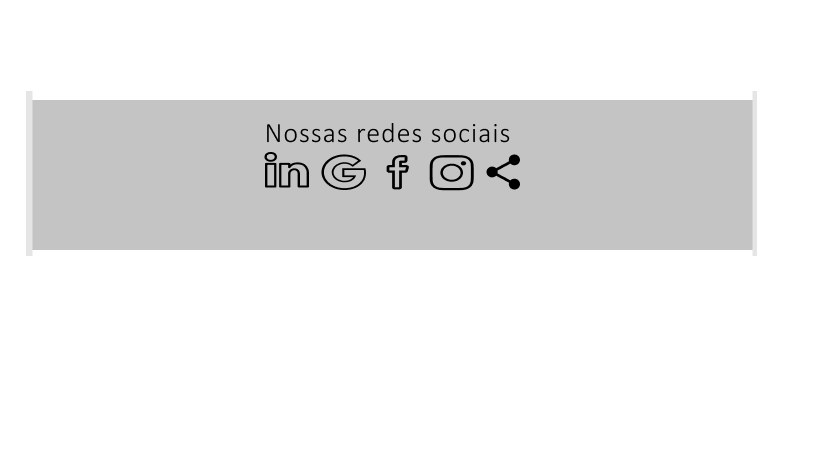

# Projeto de Interface

Desenvolvemos uma montagem da interface do sistema, com capacidade para se adaptar ao ambiente de acesso do usuário, conforme os dispositivos utilizados.
Desta forma, todo conteúdo e padrão de layout podem ser transportados para as mais variadas orientações, plataformas e dimensões de tela, com foco na facilidade de navegação, disponibilidade e usabilidade.

## Fluxo do Usuário

O diagrama da Figura a seguir mostra o fluxo de interação do usuário através das telas do sistema. Cada uma das telas neste fluxo é descrita em detalhes na seção de Wireframes. Para visualizar o Wireframe interativo, acesse o Figma.(https://www.figma.com/file/LrRbbZ3COSTbXcRlPDNx41/Projeto-Wiframes?nodeid=0%3A1)

                               Acima e mostrado o fluxo de telas do usuário.

## Wireframes

A seguir nas telas do projeto, as telas do sistema são apresentadas em detalhes nos itens que se seguem. Apresentando uma estrutura comum que é composta por um cabeçalho, conteúdo e rodapé, apresentada na Figura a seguir:

⦁ Cabeçalho (header) - onde se encontra os elementos fixos de identidade (logo) e navegação principal do site (menu da aplicação). 
⦁ Conteúdo (body) - apresenta o conteúdo da tela em questão. 
⦁ Rodapé (footer) - apresenta a última parte a ser vista por um visitante, que chegou ao final da página.

                                        Estrutura padrão do site.

## Tela – Página inicial      

A tela de página inicial mostra a estrutura padrão, o bloco de Conteúdo traz em destaque o principal objetivo do projeto que é a adoção de animais contendo (imagem, título, fonte e resumo, botão). O cabeçalho contém seis elementos diferentes:

1. Adote – pagina para o usuário adotar um animal; 
2. Doar – pagina para o usuário doar um animal; 
3. Sobre nós – nessa página falamos sobre o intuito do nosso projeto; 
4. Contato – nossas formas de contato. 
5. Cadastrar – que é a página onde o usuário fará seu cadastro para o site; 
6. Entrar – que é a página onde o usuário fará o login para o site.

                                            Tela de página inicial.

## Tela – Pagina de cadastro

O site deve permitir ao usuário criar uma conta privada, possibilitando divulgar e adotar seu animal de estimação, representado por uma imagem, título, conteúdo e botão de registro.

                                            Tela de cadastro.

## Tela – Pagina sobre nós

Uma página que mostra ao usuário o propósito do nosso projeto, representado por um título, conteúdo e imagem.

                                            Tela sobre nós.

## Tela – Pagina adote

Nessa tela permite que o usuário:

· Encontre seu animal para adotar, nas características desejadas; 
· Permiti que o usuário veja fotos e informação necessárias sobre o pet interessado; 
· Permiti salvar anúncios interessado pelo usuário; 
· Permiti que os usuários possam comentar sobre o anúncio; 
· Permiti ao usuário um botão de adotar, possibilitando mais informações privadas entre o interessado e o anunciante.

                                            Tela adote.

## Tela – Pagina doe um pet

Essa página de doe um pet e representada por um título, conteúdo, botão e imagem, permite:

· Um botão que permite ao usuário divulgar fotos e informação daquele animal (cachorro e gato) para doar.

                                            Tela doe um pet.

## Tela – Pagina de contato

Essa tela possibilita o usuário a entrar em contato conosco através dos meios de comunicação listados abaixo na foto a seguir. É representada por um título, conteúdo e imagem.

                                            Tela de contato.

## Tela – Rodapé       

Nessa tela mostra a parte final da página, nela se encontra as nossas redes socias (LinkedIn, Gmail, Facebook, Instagram, compartilhamento de página).

                                            Tela de rodapé.

                                            