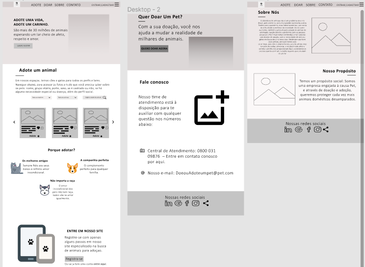
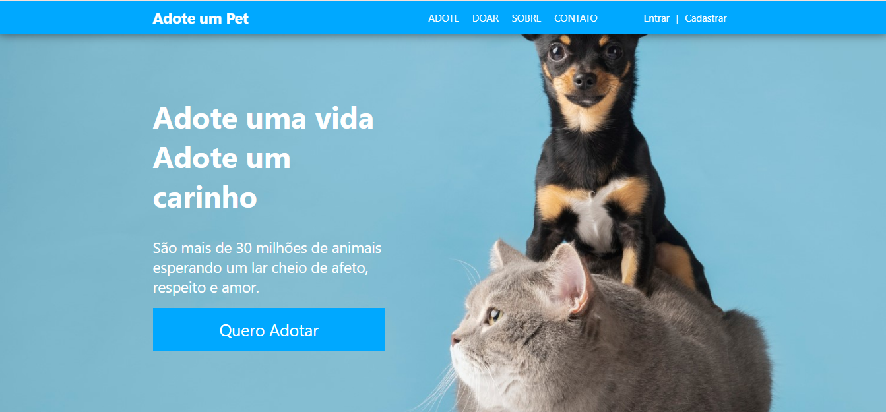
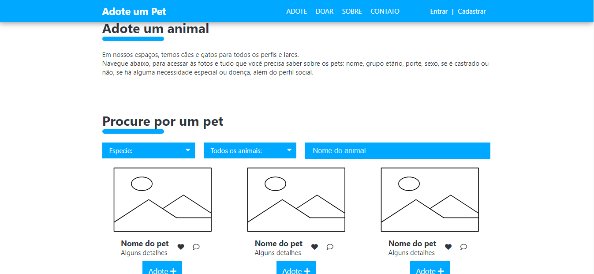
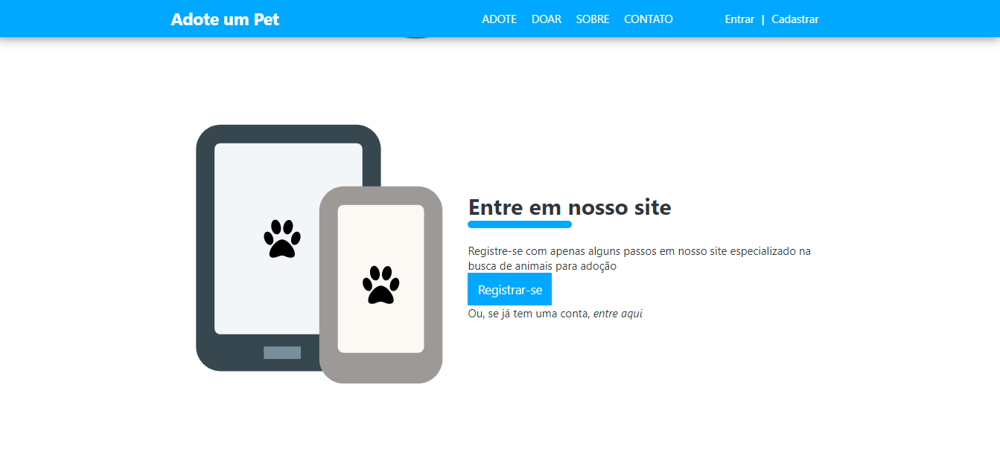

# Template padrão do site

O padrão de layout a ser utilizado pelo site tem correspondência ao projeto de Interface elaborado anteriormente, conforme a imagem abaixo:

O template criado está disponível no site https://github.com/ICEI-PUC-Minas-PMV-ADS/pmv-ads-2022-1-e1-proj-web-t6-grupo_3_adoteoudoeseupet/tree/main/src  e é composto pelos seguintes layouts:

●	Tela  página inicial 
●	Tela de adoção 
●	Tela de cadastro

## Tela – Pagina Inicial

    A tela de página inicial mostra a estrutura padrão, o bloco de Conteúdo traz em destaque o principal objetivo do projeto que é a adoção de animais contendo (imagem, título, fonte e resumo, botão).

 

 ## Tela – Pagina de adoção

 

 ## Tela – Pagina de cadastro

   O site deve permitir ao usuário criar uma conta privada, possibilitando divulgar e adotar seu animal de estimação, representado por uma imagem, título, conteúdo e botão de registro.

