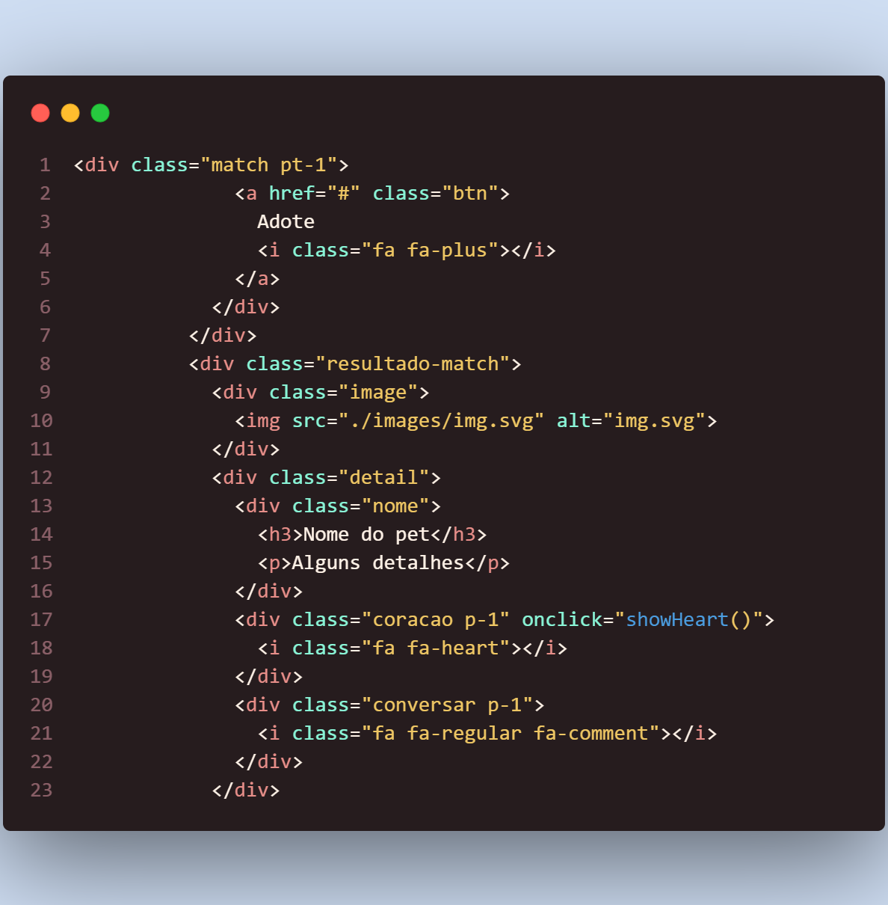

# Funcionalidades do Sistema (Telas)

     As telas desenvolvidas para cada uma das funções do sistema são exibidas nesta seção. A URL apropriada e outras instruções de acesso são apresentadas nas seguintes ordens: 

## Divulgação dos animais (RF-01 e RF-02)

O site deve permitir ao usuário divulgar seu animal (cachorro e gato) para adoção e deve permitir ao usuário encontrar seu animal para adotar, nas características desejadas. Como mostra o exemplo da tela a seguir:

## Requisitos atendidos:

●	RF-01 
●	RF-02 

## Artefatos da funcionalidade:

●	index.html 
●	main.js 
●	main.css 
●	img.svg

## Instruções de acesso:

1.	Faça o download do arquivo do projeto (ZIP) ou clone do projeto no GitHub; 
2.	Descompacte o arquivo em uma pasta específica; 
3.	Abra o Visual Studio Code e execute o Live Server; 
4.	Abra um navegador de Internet e informe a seguinte URL: http://127.0.0.1:5500/index.html#  
5.	A tela de página inicial é a primeira funcionalidade exibida pelo site; 
6.	Em seguida, role a página para baixo até ir em adote um pet.

## Estrutura do Código:

