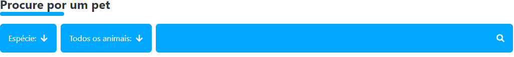

# Registro de Testes de Software

Os resultados obtidos nos testes de software realizados são descritos abaixo: 

## CT-01 – Encontrar um animal: 

O site irá permitir ao usuário encontrar seu animal para adotar, nas características desejadas. (mostrado abaixo) 

## CT-02 – Visualizar fotos e informações:

O site irá permitir ao usuário fotos e informação necessárias sobre o pet interessado. (mostrado abaixo)

## CT-03 – Salvar e comentar anúncios:

O site permitirá que anúncios estão sendo salvos corretamente e permitir que os usuários deixem comentários. (mostrado abaixo)

## CT-04 – Pagina de cadastro:

O site permitirá o cadastro de contas de usuários corretamente. (mostrado abaixo)

